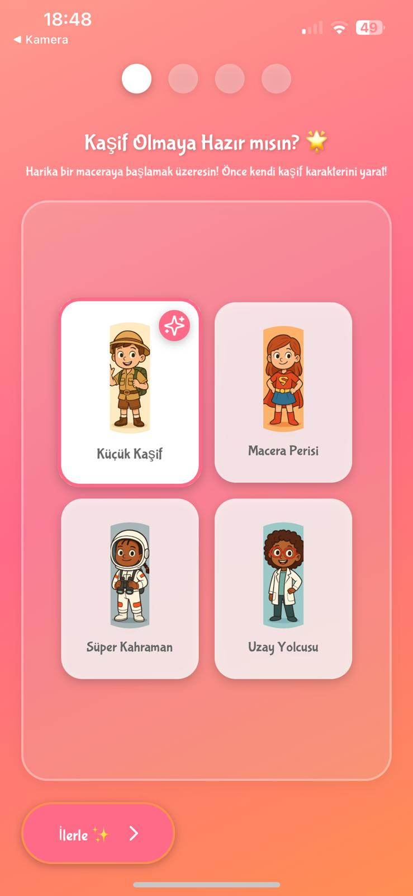
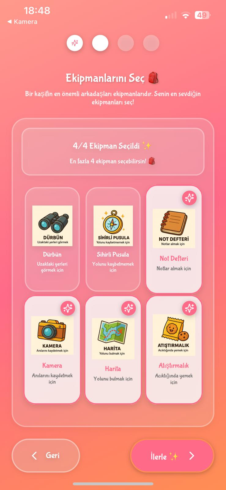
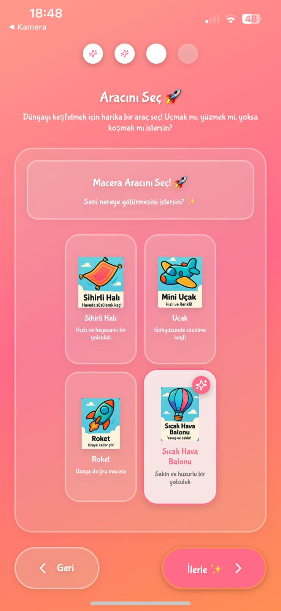
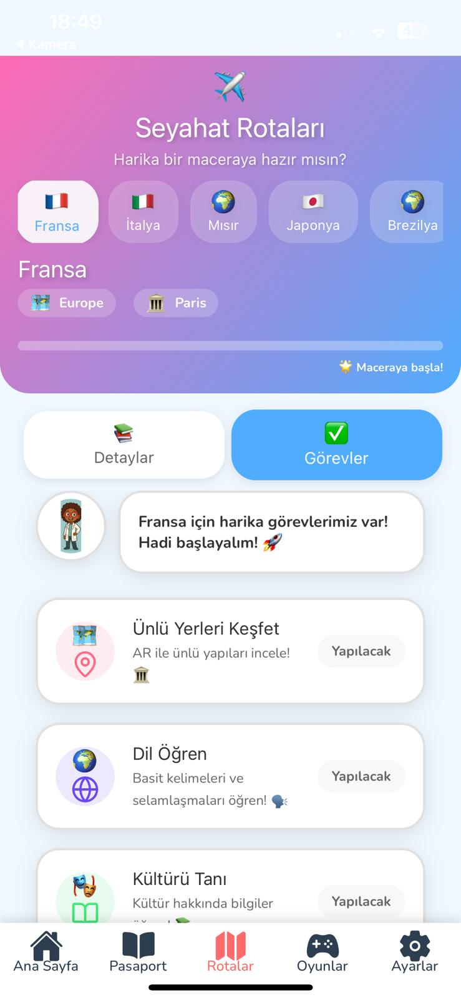
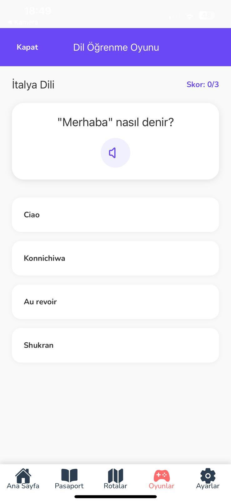
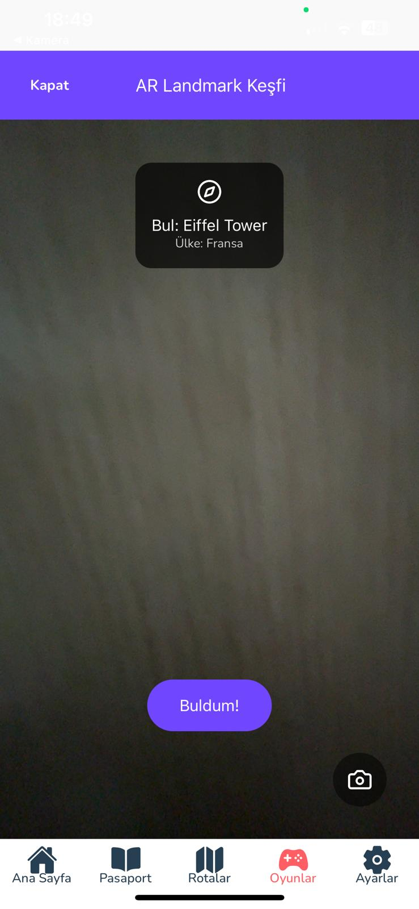

<p align="center">
  
</p>
<h2 align="center">🌐 Web Sitemiz</h2>

<p align="center">
  <a href="https://furkankayakilic.github.io/HexdoraCompany/" target="_blank">
    
  </a>
</p>

<p align="center">
  <a href="https://trello.com/b/ipdoKdbW/dunyakasifi" target="_blank">
    
  </a>
</p>

<p align="center">
  <a href="https://drive.google.com/file/d/1u_9bECziwtl03Q4_d8iAdnWdNuy-i-Is/view?usp=sharing" target="_blank">
    
  </a>
</p>

<p align="center">
  <a href="https://drive.google.com/file/d/1gqW2ci1CYsE7W8H2byNWaPG6gOTaDyBf/view?t=6" target="_blank">
    
  </a>
</p>

<p align="center">
  <a href="https://drive.google.com/file/d/1XuCgOhzqyGCu2tDhQYn1n7Tci7isBWuY/view?usp=sharing" target="_blank">
    
  </a>
</p>

<p align="center">
  <a href="https://drive.google.com/file/d/1B4wqtivso1G28LLPJbW_bhqR7QB3Fi02/view?usp=sharing" target="_blank">
    
  </a>
</p>


# 🌍 Dünya Kaşifi: React Native Tabanlı AR Eğitici Uygulama

**Geliştirici:** Hexdora Teknoloji ve Yazılım A.Ş.

---

## 📱 Proje Tanıtımı

**Dünya Kaşifi**, React Native ile geliştirilmiş, çocukların dünya üzerindeki kültürleri, dilleri ve yapıları artırılmış gerçeklik (AR) ile keşfetmesini sağlayan eğitici bir mobil oyun uygulamasıdır.

## Projenin Amacı

Bu proje; çocuklara dünya kültürlerini AR ile eğlenceli biçimde tanıtmayı, mini oyunlarla bilişsel gelişimlerini desteklemeyi, onları teknolojiyle tanıştırmayı ve ebeveynlere güvenli, eğitici bir öğrenme ortamı sunmayı amaçlamaktadır.

---
## 🚀 Kurulum ve Geliştirme
### Gereksinimler
```bash
git clone https://github.com/furkankayakilic/HexdoraCompany.git
cd project
npm install
```

#### Android (bare workflow için):

```bash
npx react-native run-android
```

#### iOS (MacOS üzerinde):

```bash
npx pod-install
npx react-native run-ios
```
```bash
#### Expo (Expo üzerinde):
npm install
npx expo start
```
---

## 🌍 Uygulama Platformları

- **Android:** Android 7.0+ (ARCore destekli)
- **iOS:** iOS 11+ (ARKit destekli)

> ⚠️ Uygulama, cihazın AR desteği olması koşuluyla sorunsuz çalışır. Destek için: [https://developers.google.com/ar/devices](https://developers.google.com/ar/devices)

---

## Kullanım Talimatları

🗺️ Dünya Kaşifi - Kısa Kullanım Kılavuzu 🚀
🔹 1. Uygulamaya Başlangıç
Uygulamayı aç ve karakterini seç.

Bir macera aracı (ör. roket, sihirli halı) belirle.

En fazla 4 adet ekipman seç (dürbün, not defteri vb.).

Seçimlerini tamamla ve Kaşif Sertifikanı al.

🔹 2. Ana Ekran ve Gezinme
Ana Sayfa 🏠: Dünya haritasını gör, ülkeleri keşfet.

Pasaport 📕: Seviyeni, rozetlerini ve öğrendiğin dilleri takip et.

Rotalar 📍: Yeni keşif rotalarını incele.

Oyunlar 🎮: Eğlenceli mini oyunlarla öğren.

Ayarlar ⚙️: Dil, bildirim ve yardım seçeneklerini düzenle.

🔹 3. Temel Özellikler
AR Keşif: Harita üzerindeki ülkelere dokunarak artırılmış gerçeklik içeriklerini görüntüle.

Mini Oyunlar: Ülke bilgisi, boyama ve matematik oyunlarıyla öğrenmeyi eğlenceli hale getir.

Pasaport Sistemi: Rozet ve seviye takibi, öğrendiğin dillerin listesi.

Çocuk Dostu Tasarım: Basit menüler, sesli anlatımlar, etkileşimli içerikler.

❓ Yardım İçin
Ayarlar menüsünden yardım ve destek seçeneklerine ulaşabilirsin.

🎉 Hazırsan, dünyayı keşfetmeye başla Kaşif! 🌍✨

---
## ⭐ Öne Çıkan Özellikler

### 🧠 Artırılmış Gerçeklik Deneyimleri (ViroReact)

- 3D dünya haritası ve ülke simgeleri
- Ünlü yapılar: Eyfel Kulesi, Big Ben, Özgürlük Heykeli
- Kamera üzerinden etkileşimli AR görevler

---
## Uygulama Ekran Görüntüleri

<div style="display: flex; flex-wrap: wrap; justify-content: center; gap: 10px;">

  
  
  


  
  
  

</div>

## 🧑‍💻 Geliştirici Ekip (Hexdora)

| İsim                 | Rol                    | Sorumluluklar                                 |
| -------------------- | ---------------------- | --------------------------------------------- |
| Furkan Kaya Kılıç    | Scrum Master           | Proje yönetimi ve oyun akışı                  |
| Mustafa Erdem Çelik  | Mobil AR Geliştirici   | React Native, ViroReact, AR bileşenleri       |
| Gülendam Nida Çevlik | UI/UX & İçerik         | Figma tasarımı, bilgi içerikleri, animasyonlar|

---

## 🔧 Kullanılan Teknolojiler

- **Mobil Geliştirme:** React Native (Expo & bare workflow)
- **AR Kütüphanesi:** ViroReact
- **3D Modelleme:** Blender
- **UI/UX:** Figma, Lottie
- **CI/CD:** GitHub Actions + EAS Build (Expo)

---


## 📄 Lisans

© 2025 Hexdora Teknoloji A.Ş. Tüm hakları saklıdır.  
Bu proje [MIT Lisansı](LICENSE) ile lisanslanmıştır.

---

## 📞 İletişim

- **E-posta:** iletisim@hexdora.com  
- **Web Sitesi:** [www.hexdora.com](https://www.hexdora.com)  
- **LinkedIn:** [Hexdora Teknoloji](https://linkedin.com/company/hexdora)


