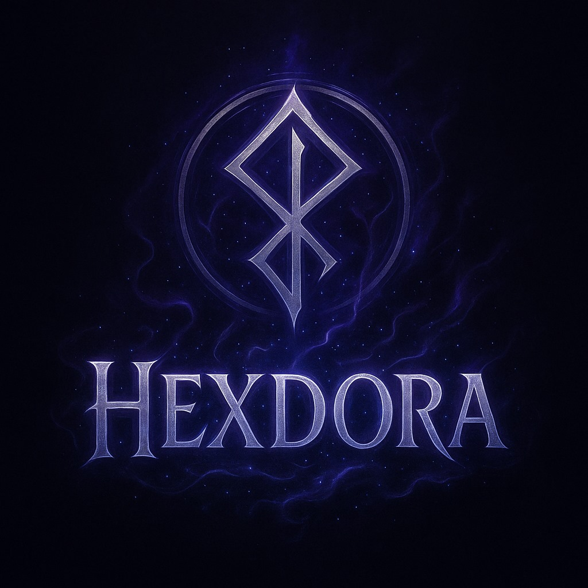

<p align="center">
  
</p>
<h2 align="center">🌐 Web Sitemiz</h2>

<p align="center">
  <a href="https://furkankayakilic.github.io/HexdoraCompany/" target="_blank">
    
  </a>
</p>

<p align="center">
  <a href="https://drive.google.com/file/d/1u_9bECziwtl03Q4_d8iAdnWdNuy-i-Is/view?usp=sharing" target="_blank">
    
  </a>
</p>

# 🌍 Dünya Kaşifi: React Native Tabanlı AR Eğitici Uygulama

**Geliştirici:** Hexdora Teknoloji ve Yazılım A.Ş.

---

## 📱 Proje Tanıtımı

**Dünya Kaşifi**, React Native ile geliştirilmiş, çocukların dünya üzerindeki kültürleri, dilleri ve yapıları artırılmış gerçeklik (AR) ile keşfetmesini sağlayan eğitici bir mobil oyun uygulamasıdır.

---

## 🌍 Uygulama Platformları

- **Android:** Android 7.0+ (ARCore destekli)
- **iOS:** iOS 11+ (ARKit destekli)

> ⚠️ Uygulama, cihazın AR desteği olması koşuluyla sorunsuz çalışır. Destek için: [https://developers.google.com/ar/devices](https://developers.google.com/ar/devices)

---

## ⭐ Öne Çıkan Özellikler

### 🧠 Artırılmış Gerçeklik Deneyimleri (ViroReact)

- 3D dünya haritası ve ülke simgeleri
- Ünlü yapılar: Eyfel Kulesi, Big Ben, Özgürlük Heykeli
- Kamera üzerinden etkileşimli AR görevler

### 🎭 Avatar ve Kişiselleştirme

- Kaşif karakter oluşturma
- Sihirli araçlar: Pusula, dürbün, tercüman

### 🎮 Eğitici Mini Oyunlar

- Dil öğrenme: Sesli kartlar, temel kelimeler
- Bilgi yarışması: Ülke kültürleriyle ilgili sorular
- Boyama: Dijital boyama deneyimi
- Matematik oyunları: Temel işlemler ve eğlenceli sorular

### 🗺️ Oyun Akışı

1. **Kaşif Akademisi**: Profil, avatar, araç seçimi
2. **Uçuş Haritası**: 3D dünya üzerinde ülke seçimi
3. **Görev Sistemi**: Kültürel & dil tabanlı görevler
4. **AR Etkileşimleri**: Kamera üstünden görev deneyimi
5. **Kaşif Pasaportu**: Ülke mühürleri ve ödüller

---

## 🧑‍💻 Geliştirici Ekip (Hexdora)

| İsim                 | Rol                    | Sorumluluklar                                 |
| -------------------- | ---------------------- | --------------------------------------------- |
| Furkan Kaya Kılıç    | Scrum Master           | Proje yönetimi ve oyun akışı                  |
| Mustafa Erdem Çelik  | Mobil AR Geliştirici   | React Native, ViroReact, AR bileşenleri       |
| Gülendam Nida Çevlik | UI/UX & İçerik         | Figma tasarımı, bilgi içerikleri, animasyonlar|

---

## 🔧 Kullanılan Teknolojiler

- **Mobil Geliştirme:** React Native (Expo & bare workflow)
- **AR Kütüphanesi:** ViroReact
- **3D Modelleme:** Blender
- **UI/UX:** Figma, Lottie
- **CI/CD:** GitHub Actions + EAS Build (Expo)

---

## 🚀 Kurulum ve Geliştirme
### Gereksinimler
```bash
git clone https://github.com/furkankayakilic/HexdoraCompany.git
cd project
npm install
```

#### Android (bare workflow için):

```bash
npx react-native run-android
```

#### iOS (MacOS üzerinde):

```bash
npx pod-install
npx react-native run-ios
```
```bash
#### Expo (Expo üzerinde):
npm install
npx expo start
```
---

## 🗓️ Yol Haritası

- **Q1 2025:** Proje Planlama & React Native mimarisi
- **Q2 2025:** AR sahneleri ve temel özellikler
- **Q3 2025:** Mini oyunlar & içerik geliştirme
- **Q4 2025:** Test, hata düzeltme ve APK/IPA build
- **Q1 2026:** V1.0 Yayını
- **Q2 2026:** Ülke paketleri ve yeni görevler
- **Q3 2026:** Çoklu oyunculu özellikler

---

## 📄 Lisans

© 2025 Hexdora Teknoloji A.Ş. Tüm hakları saklıdır.  
Bu proje [MIT Lisansı](LICENSE) ile lisanslanmıştır.

---

## 📞 İletişim

- **E-posta:** iletisim@hexdora.com  
- **Web Sitesi:** [www.hexdora.com](https://www.hexdora.com)  
- **LinkedIn:** [Hexdora Teknoloji](https://linkedin.com/company/hexdora)


